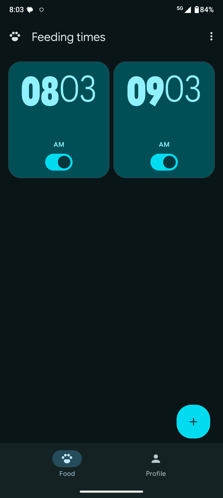
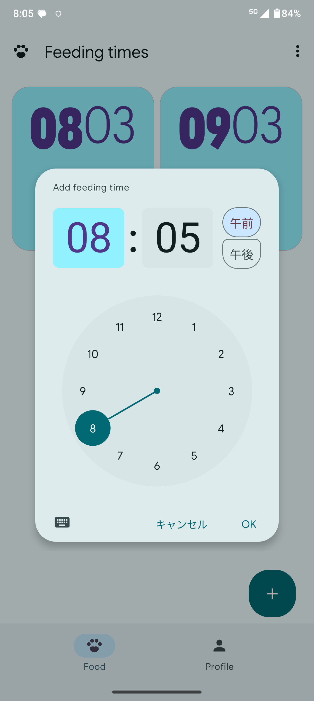

# Feeding Times 

A clean, modern, and open-source pet feeding reminder app inspired by Material Design 3 guidelines[cite: 1, 2, 3]. Never miss a feeding schedule for your beloved pets again!

  
  &nbsp;&nbsp;&nbsp;&nbsp;
  

##  Features

- **Material Design 3 UI**: Clean, expressive, and modern UI following official Material 3 design principles[cite: 1, 2, 3].
- **Flexible Feeding Schedules**: Set up custom feeding alarm times easily with an intuitive time picker[cite: 1, 2].
- **Timely Notifications**: Receive local notifications when it's time to feed your pets[cite: 1, 2].
- **Dark & Light Theme**: Seamlessly adapts to your system preferences[cite: 1, 2].
- **Free & Open Source (FOSS)**: 100% free, privacy-friendly, and open-source with no ads or tracking.

##  Future Roadmap

We are actively working on improving **Feeding Times**! Planned features for upcoming releases include:

- [ ] **Pet Profiles**: Customize settings and feeding schedules for multiple pets separately[cite: 1, 2].
- [ ] **Feeding History / Logs**: Track completed feedings and keep a daily log.
- [ ] **Custom Notification Sounds & Vibration Patterns**: Personalized alerts for different feeding routines.
- [ ] **Snooze & Confirmation Options**: Easily confirm or delay reminders directly from the notification shade.
- [ ] **Home Screen Widgets**: Quick-view cards to see upcoming feeding times directly on your home screen.

##  Screenshots

| Main Dashboard (Dark Mode) | Time Picker Dialog |
| :---: | :---: |
|  |  |

##  Tech Stack & Requirements

- **Language / Framework**: Android (Kotlin / Jetpack Compose)
- **UI Guidelines**: Material Design 3 (M3)[cite: 1, 2, 3]

##  Contributing

Contributions, issues, and feature requests are welcome! Feel free to check the [issues page](../../issues) if you want to contribute or report bugs.

##  License

This project is open-source and released under the [MIT License](LICENSE).
